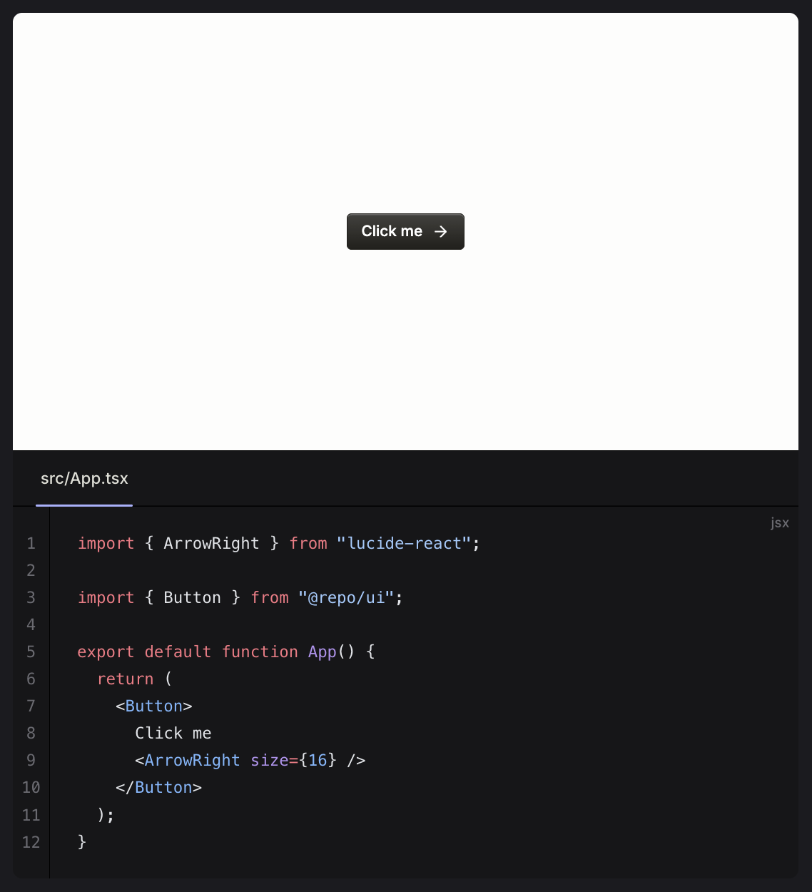

# @conversion-ai/vitepress-plugin-previews

No-dependencies [VitePress](https://vitepress.dev/) plugin for displaying static previews of code groups built as Vite projects.

Alternative to [vitepress-plugin-sandpack](https://vitepress-sandbox.js-bridge.com/) but static and hosted alongside VitePress.

Perfect for previews referencing private packages or for component libraries building examples into their documentation like [Radix Themes](https://www.radix-ui.com/themes/docs/overview/getting-started).

- [Installation](#installation)
- [Usage](#usage)
  - [Basic](#basic)
  - [Replace](#replace)
  - [React](#react)
- [Templates](#templates)
- [Caveats](#caveats)



## Installation

> [!IMPORTANT]  
> Add `.vitepress/.previews/cache` to your `.gitignore` to prevent comitting and pushing previews.

```bash
bun add @conversion-ai/vitepress-plugin-previews
```

```bash
npm install @conversion-ai/vitepress-plugin-previews
```

```bash
yarn add @conversion-ai/vitepress-plugin-previews
```

Then, wrap your VitePress configuration. Read more about the [caveats](#caveats) below.

```ts [.vitepress/config.ts]
import { defineConfig } from "vitepress";
import { withPreviews } from "@conversion-ai/vitepress-plugin-previews";
import react from "@vitejs/plugin-react";

export default withPreviews(
  defineConfig({
    previews: {
      // Configure Vite for all previews
      vite: {
        plugins: [react()],
      },
    },

    // Your existing VitePress configuration
    ...
  })
);
```

### Options

```ts
interface PreviewsPluginOptions {
  /**
   * The Vite configuration to use for all previews.
   *
   * `build.emptyOutDir` will be set to `true` by default.
   *
   * `build.outDir` will be set based on `build.base`.
   */
  vite?: import("vite").UserConfig;

  /**
   * The default template to use for previews.
   *
   * This will be overridden by the template specified in the code group.
   */
  defaultTemplate?: string;

  build?: {
    /**
     * The origin of the previews in production.
     */
    origin?: string;

    /**
     * The base path of the previews in production.
     *
     * Defaults to `/` when the origin has been set, otherwise `/_previews/`.
     */
    base?: string;

    /**
     * Relative to the VitePress output directory, the output directory for the previews in production.
     *
     * Defaults to `_previews`.
     */
    outDir?: string;
  };
}
```

## Usage

### Basic

Add the `preview` flag to any code group.

````md
::: code-group preview

```tsx [main.tsx]
import { createRoot } from "react-dom/client";

createRoot(document.getElementById("root") as HTMLElement).render(
  <button>Click me</button>
);
```

```html [index.html]
<!DOCTYPE html>
<html lang="en">
  <head>
    <meta charset="UTF-8" />
    <meta name="viewport" content="width=device-width, initial-scale=1" />
  </head>
  <body>
    <div id="root"></div>
    <script type="module" src="./main.tsx"></script>
  </body>
</html>
```

:::
````

### Replace

Add the `replace` flag to a code group preview to replace the code group with the preview instead of displaying both.

> [!NOTE]
> The order of attributes, such as `template=react` and `replace`, does not matter. However, `preview` must always come first. The `example-template` template is not included, but templates can be [added easily](#templates).

````md
::: code-group preview template=example-template replace

```tsx [src/App.tsx]
export default function App() {
  return <button>Click me</button>;
}
```

:::
````

### React

Include [@vitejs/plugin-react](https://www.npmjs.com/package/@vitejs/plugin-react) in your VitePress configuration for previews.

```ts [.vitepress/config.ts]
import { defineConfig } from "vitepress";
import { withPreviews } from "@conversion-ai/vitepress-plugin-previews";
import react from "@vitejs/plugin-react";

export default withPreviews(
  defineConfig({
    previews: {
      vite: {
        plugins: [react()],
      },
    },
  })
);
```

Voila.

````md
::: code-group preview

```tsx [src/App.tsx]
import { useState } from "react";
import "./App.css";

export default function App() {
  const [count, setCount] = useState(0);

  return (
    <div className="app">
      <h1>Count: {count}</h1>
      <button onClick={() => setCount(count + 1)}>Increment</button>
    </div>
  );
}
```

```css [src/App.css]
.app {
  padding: 2rem;
  text-align: center;
}

button {
  padding: 0.5rem 1rem;
  font-size: 1rem;
  margin-top: 1rem;
}
```

```tsx [src/main.tsx]
import { createRoot } from "react-dom/client";

import App from "./App";

createRoot(document.getElementById("root") as HTMLElement).render(<App />);
```

```html [index.html]
<!DOCTYPE html>
<html lang="en">
  <head>
    <meta charset="UTF-8" />
    <meta name="viewport" content="width=device-width, initial-scale=1" />
  </head>
  <body>
    <div id="root"></div>
    <script type="module" src="./src/main.tsx"></script>
  </body>
</html>
```

:::
````

## Templates

By default, previews only consist of files defined within code groups. However, you may want to base previews off of a template and only overwrite relevant files.

Templates are stored as directories within `.vitepress/.previews/templates`, and they can be referenced in two places.

### Default template

A default template can be specified in the VitePress configuration.

```ts [.vitepress/config.ts]
import { defineConfig } from "vitepress";
import { withPreviews } from "@conversion-ai/vitepress-plugin-previews";

export default withPreviews(
  defineConfig({
    previews: {
      defaultTemplate: "example-template",
    },
  })
);
```

### Code group templates

Templates can be specified per code group and will overwrite the default template.

````md
::: code-group preview template=example-template replace

```tsx [src/App.tsx]
export default function App() {
  return <button>Click me</button>;
}
```

:::
````

## Caveats

- Snippet imports are not supported
